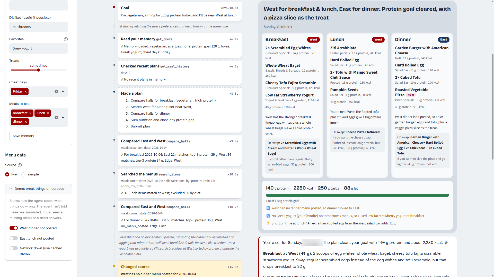
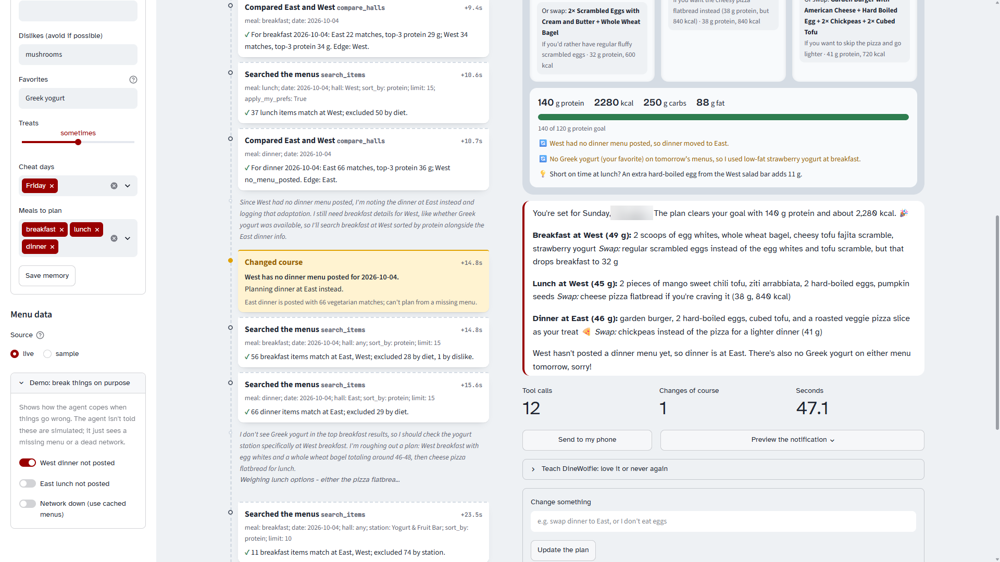
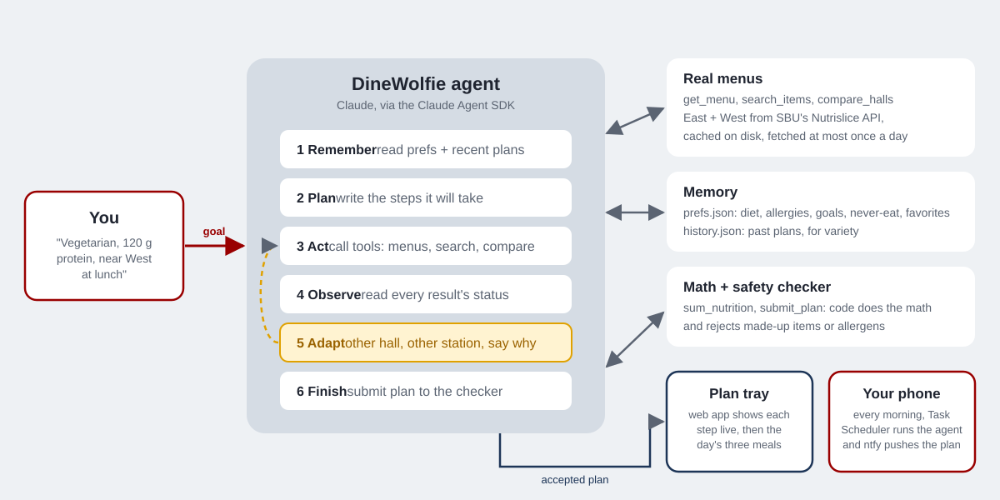

# DineWolfie 🐺

**An AI agent that plans your day of eating at Stony Brook's East Side and West Side dining halls around your goals, so you never have to scroll the menu app again.**

Tell it something like *"I'm vegetarian, aiming for 120 g protein today, and I'll be near West at lunch."* DineWolfie reads your saved preferences, pulls today's real menus for both halls, compares them, adds up the nutrition in code, works around anything that's missing, and hands you breakfast, lunch and dinner: which hall, which items, and why. Every morning it can also do this on its own and push the plan to your phone.



| The agent changes course when West hasn't posted dinner | How it works |
|---|---|
|  |  |

Built for the AI Community @ SBU Internal Competition 2026 (Agentic AI).

---

## Why it's an agent, not a chatbot

| Agentic quality | What DineWolfie does |
|---|---|
| **Goal-directed** | Works toward your goal for the whole day (protein, calories, diet, location), not one question. |
| **Plans** | Writes a step list (`make_plan`) before acting and rewrites it when it changes course. |
| **Uses real tools** | 11 tools: live Nutrislice menus, search, hall comparison, nutrition math, memory, plan checker. |
| **Observes** | Every tool returns a `status` (`ok`, `no_menu_posted`, `no_matches`, `error`, `rejected`) that it must read. |
| **Adapts** | Missing menu → other hall. Filter leaves nothing → other station. Goal unreachable → closest plan plus the exact gap and a fix. Network down → cached menus. Each change is logged (`log_adaptation`) and shown highlighted. |
| **Verifies itself** | `submit_plan` rejects any item that isn't on that hall's menu that day or that breaks your allergies/diet. The agent has to fix the plan and resubmit. |
| **Remembers** | `prefs.json` (diet, allergies, goals, never-eat list, favorites, treats, cheat days) and `history.json` (past plans, for variety). It updates memory when you state a lasting preference, or when you tap **Love it** / **Never again**. |
| **Autonomous** | A scheduled morning run plans your day and pushes it to your phone with no human in the loop. |

## Feels like a friend, not a calculator

* **Swaps for every meal.** Each meal comes with an alternative with similar protein ("if the Grill line is long"), sometimes at the other hall. Swaps go through the same checker.
* **Treats and cheat days.** Set treats to never / sometimes / often and pick cheat days. When it fits, DineWolfie adds a treat (tagged on the tray). On a cheat day it relaxes calories but never your allergies, diet or blacklist.
* **Never-eat blacklist vs. dislikes.** Dislikes are avoided when possible; never-eat foods are blocked as strictly as allergies.
* **Favorites.** If something you love is on the menu, it's picked first. If it isn't, the agent tells you and finds a stand-in.
* **One-tap feedback.** Under each plan: **Love it** adds to favorites, **Never again** blacklists the item.
* **Follow-ups.** "Make dinner lighter" or "remember I'm allergic to soy": the agent continues the same conversation, updates memory if needed, and re-plans.

The model decides; the code calculates. Every number you see comes from Python, never from the model, so it can't make up nutrition facts.

---

## Requirements

* Windows 11 or macOS, **Python 3.11+** (tested on 3.14)
* **Claude Code** installed and logged in with a Claude plan (Pro/Max). The agent runs on the [Claude Agent SDK](https://code.claude.com/docs/en/agent-sdk/overview), which uses your Claude Code login. Usage counts against your plan's limits.
* Optional: the free **ntfy** app on your phone for the morning push.

> Don't set `ANTHROPIC_API_KEY` unless you mean to: an API key takes priority over your plan login and bills your API account instead.

## Setup (Windows PowerShell)

```powershell
git clone https://github.com/<your-username>/dinewolfie.git
cd dinewolfie
python -m venv .venv
.venv\Scripts\Activate.ps1
pip install -r requirements.txt
copy .env.example .env
```

Mac/Linux: use `source .venv/bin/activate` and `cp .env.example .env`.

If PowerShell refuses to run `Activate.ps1`, run `Set-ExecutionPolicy -Scope CurrentUser RemoteSigned` once.

Log Claude Code in once (opens a browser; choose your Claude subscription):

```powershell
claude auth login
```

If `claude` isn't found, install Claude Code from https://code.claude.com, or run `& "$env:USERPROFILE\.local\bin\claude.exe" auth login`.

Edit `prefs.json` (or use the sidebar in the app) with your own diet, allergies and goals.

## Run it

**Web app** (the live "agent at work" view):

```powershell
streamlit run app.py
```

Opens http://localhost:8501. Type a goal, press **Plan my day**, and watch each step land on the ticket rail.

**Terminal:**

```powershell
python -m src.cli "I'm vegetarian, aiming for 120 g protein, near West at lunch"
python -m src.cli --date tomorrow "high protein, under 2000 kcal"
```

**Show it adapting** (simulated failures; the agent isn't told they're simulated):

```powershell
python -m src.cli --simulate missing:West:dinner "plan my day, I prefer West"
python -m src.cli --simulate offline "plan my day"
```

In the web app the same switches are in the sidebar under **Demo: break things on purpose**.

**Offline / judges' mode:** `--sample` (or `DINEWOLFIE_DATA_MODE=sample` in `.env`) uses the real menus saved in `data/sample/`, so it works without network access to Nutrislice.

**Tests** (offline, no Claude calls):

```powershell
python -m pytest
```

## Phone notifications (morning push)

1. Install **ntfy** on your iPhone (App Store) and tap **+** to subscribe to a topic. Make the name long and random, like `dinewolfie-7f3k9q2m`. Anyone who knows it can read your messages.
2. Put the same name in `.env`: `NTFY_TOPIC=dinewolfie-7f3k9q2m`
3. Send a test: `python -m src.notify`
4. Try the morning run without sending: `python -m src.morning_run --dry-run`
5. Schedule it for 8:00 every day:

```powershell
powershell -ExecutionPolicy Bypass -File scripts\install_morning_task.ps1
Start-ScheduledTask -TaskName "DineWolfie Morning Plan"    # test it now
```

The PC has to be on (or asleep with wake timers allowed) at that time; if it was off, the task runs as soon as it's back. Each run logs every agent step to `data/logs/`. Remove the task with `scripts\uninstall_morning_task.ps1`.

## How it works

```
You ──goal──▶ Claude (Agent SDK loop) ──tools──▶ Nutrislice menus (cached) · memory · nutrition math
                    ▲          │
                    └─observe──┘   adapt when something fails
                               │
                         submit_plan ──checker──▶ plan tray (web) · phone push (ntfy)
```

| File | What it does |
|---|---|
| `config.py` | Nutrislice URLs, hall ids, meal rules, allergen/tag mapping, settings from `.env` |
| `src/fetch_menu.py` | Downloads one station-week at a time, caches to `data/menus/`, falls back to cache on failure |
| `src/parse_menu.py` | Raw Nutrislice JSON → clean items (name, station, meals, nutrition, allergens, tags) |
| `src/tools.py` | The agent's tools as plain, tested Python functions |
| `src/agent.py` | System prompt + tools wired into the Claude Agent SDK; streams every step as an event |
| `app.py` | Streamlit UI: goal, live ticket rail, plan tray, memory editor, menu browser, history |
| `src/cli.py` | Terminal mode with the same live trace |
| `src/morning_run.py`, `src/notify.py` | Scheduled run and ntfy push |
| `docs/data-notes.md` | The real Nutrislice endpoints and field names |

## Data

Menu data comes from Stony Brook University's Nutrislice menus (`stonybrook.api.nutrislice.com`), used with permission from SBU Campus Dining. DineWolfie is polite about it: one request covers a whole week for one station, results are cached on disk, a station is fetched at most once a day, requests are spaced out and identify the project, and if the server refuses a request we stop instead of retrying. Nutrition values are Nutrislice's per-serving numbers. When an item has none, DineWolfie says "nutrition not listed" instead of guessing.

## Notes

* Anyone running DineWolfie needs their own Claude login (or an API key).
* DineWolfie isn't medical or dietary advice. Always confirm allergens with dining staff.
